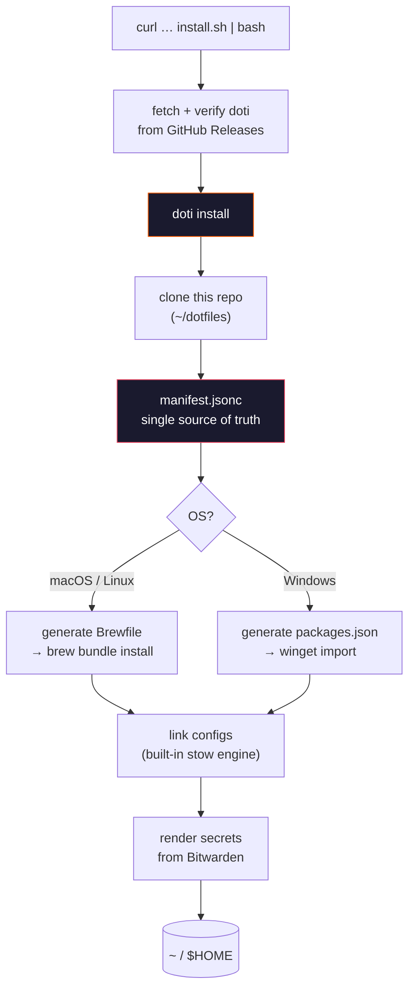

<div align="center">

# dotfiles

**Bare machine to fully configured, in one command.**


<p>
  <a href="#quick-start">Quick start</a>
  ·
  <a href="#commands">Commands</a>
  ·
  <a href="#architecture">Architecture</a>
  ·
  <a href="#structure">Structure</a>
  ·
  <a href="#packages">Packages</a>
  ·
  <a href="#uninstall">Uninstall</a>
  ·
  <a href="#everyday-cheatsheet">Cheatsheet</a>
</p>

</div>

---

Cross-platform config for macOS, Linux, and Windows. Configs are symlinked into
place with [GNU Stow](https://www.gnu.org/software/stow/) (a small PowerShell
equivalent on Windows), and a single command bootstraps the package manager and
installs everything. Install git, run one command, done.

## Quick start

One command on a new machine:

```bash
curl -fsSL https://raw.githubusercontent.com/riptone/tone.rip/main/apps/doti/scripts/install.sh | bash
```

That script does the four things a Go binary cannot do for itself — work out
the platform, make sure `git` exists, download `doti` from its GitHub release
and verify it against the release's `SHA256SUMS` — then hands over. `doti`
clones this repository, installs the packages, links the configs and renders
the secrets.

Already have the binary?

```bash
doti              # interactive menu
doti install      # everything, no prompts
doti adopt        # a machine you already use: scan first, fill only the gaps
doti check        # what is missing, changes nothing
```

**Windows** (PowerShell):

```powershell
irm https://raw.githubusercontent.com/riptone/tone.rip/main/apps/doti/scripts/install.ps1 | iex
```

Symlinks need **Developer Mode** on (Settings → Privacy & security → For
developers) or an elevated shell. The installer checks and warns up front
rather than letting you find out halfway through linking.

## Commands

`doti` is one binary on every platform, so there is one spelling of each
command rather than a flag per shell.

| Do this | Command |
|---|---|
| Interactive menu | `doti` |
| Install everything | `doti install` |
| Smart install (existing machine) | `doti adopt` |
| Preview, change nothing | `doti install -n` |
| Configs only | `doti link` |
| One component | `doti link --only ghostty` |
| Remove all links | `doti unlink` |
| Remove one component's links | `doti unlink --only ghostty` |
| Remove links and restore backups | `doti unlink --restore` |
| Health check | `doti check` (add `--strict` to exit non-zero) |
| Pull latest, then re-link | `doti sync` |
| Upgrade packages | `doti update` |
| Render secrets from Bitwarden | `doti secrets` |
| Update doti itself | `doti upgrade` |
| Preview the generated package lists | `doti packages` |
| Check the manifest parses | `doti validate` |

`-n` is the dry run and works on every command that writes. `--repo DIR`
points at a checkout other than `$DOTFILES_DIR` (default `~/dotfiles`).

## Architecture

Two repositories, one job each.



**This repository is data.** The stow packages and `manifest.jsonc`, and
nothing else. It used to also hold the installer — `scripts/install.sh`,
`scripts/Install.ps1`, `scripts/Main.ps1` and two bootstraps, **2,815 lines**
implementing the same operations twice in two languages, with three
"keep them in sync" rules in `AGENTS.md` holding them together. That is now
one Go binary that cross-compiles, so the class of bug is gone rather than the
instances.

**The tool is [`apps/doti`](https://github.com/riptone/tone.rip/tree/main/apps/doti)**
in the tone.rip monorepo, released on `doti/v*` tags. It reuses the release
machinery `apps/ssh-cv` already had, and shares its window chrome through
`packages/gotui` — which is why the menu looks like `ssh cv.tone.rip`.

**GNU Stow is gone too.** `Main.ps1` already reimplemented it because stow
does not run on Windows, so there were two implementations to maintain. There
is now one, in Go, and one less package to install. The layout convention is
unchanged: a package directory mirrors `$HOME`, and directories are *folded* —
one symlink for a whole subtree where nothing else needs to share it.

```
stow/.stow-global-ignore       ->  ~/.stow-global-ignore
zsh/.zshrc                     ->  ~/.zshrc
zsh/.zsh/aliases.zsh           ->  ~/.zsh/aliases.zsh
ghostty/.config/ghostty/config ->  ~/.config/ghostty/config
git/.gitconfig                 ->  ~/.gitconfig
git/.config/git/ignore         ->  ~/.config/git/ignore
ripgrep/.config/ripgrep/config ->  ~/.config/ripgrep/config
opencode/.config/opencode/...  ->  ~/.config/opencode/...
starship/.config/starship.toml ->  ~/.config/starship.toml
```

Anything already there — a real file, or a stale symlink from another
checkout — is moved to `~/.dotfiles-backups/<timestamp>/` first, and
`doti unlink --restore` puts the newest run back. Re-running is safe: a link
that is already correct is left alone, mtime included.

## Secrets

Credentials never live in this repository. They live in **Bitwarden**, and
`doti secrets` renders them into `$HOME` at install time.

They are deliberately *not* stow packages. Stow symlinks `$HOME` into this
repo, so a stowed secret sits in the working tree and is one `git add -A` away
from being committed — which is exactly how a credential file ends up in
history. Rendered secrets are written straight to their target, `0600`, and
never exist inside the repo.

Two modes, declared per entry in `manifest.jsonc`:

| Mode | For | How |
|---|---|---|
| `file` | A file that is sensitive end to end | One Bitwarden field (a secure note) written out verbatim |
| `template` | Mostly-public config with a few secret fields | A checked-in `.tmpl` with named holes filled from the vault |

```bash
bw login                            # once per machine
export BW_SESSION=$(bw unlock --raw)
doti secrets                        # or just `doti install`
```

**The deployment matters.** This account is on the EU cloud, and `bw` defaults
to the US one without mentioning it - so `bw login` fails with *"Invalid
master password"*, which is a wrong-server error wearing a wrong-password
message. `manifest.jsonc` declares it under `vault.server`, and `doti secrets`
runs `bw config server` before unlocking, so this only bites if you run
`bw login` by hand before doti has been near the machine. If you do:

```bash
bw config server https://vault.bitwarden.eu
```

Secrets run **last** and are allowed to fail: a machine with no vault access
still ends up fully configured, minus the credential files, and says so. The
session key is held in memory and passed to `bw` through its environment —
never written to disk, never put in `argv`.

## Structure

| Path | What |
|---|---|
| **`manifest.jsonc`** | **Single source of truth** — components, tools, configs, health checks, secrets |
| `manifest.schema.json` | JSON Schema for the above (editor autocomplete + CI validation) |
| `git/.gitconfig.local.tmpl` | Template for the machine-local git config `doti` renders |
| `win/terminal/settings.json` | Windows Terminal config (lives outside `$HOME`, linked directly) |
| `win/powershell/profile.ps1` | PowerShell profile (prompt, tools, aliases) |
| `win/defender-exclusions.ps1` | Defender exclusions for OpenCode/npm hot paths (run once, elevated) |
| `.gitattributes` | Forces LF on `*.sh` so a CRLF checkout cannot break a shell config |
| `stow/` `zsh/` `ghostty/` `git/` `ripgrep/` `opencode/` `starship/` | Stow packages (mirror `$HOME`) |

## Packages

Edit **`manifest.jsonc`** to add or remove a tool. The `Brewfile` and
`packages.json` are generated from it at install time, into a temp directory —
neither is committed, so neither can drift from the manifest.

```bash
doti packages           # print both
doti packages --brew    # Brewfile only
```

- **CLI:** git, curl, node, bun, jq, ripgrep, fd, fzf, zoxide, eza, bat, starship,
  rtk, opencode, bitwarden-cli
- **zsh:** zsh-autosuggestions, zsh-fast-syntax-highlighting (PSReadLine on Windows)
- **GUI:** Visual Studio Code, Brave, **Ghostty** (macOS/Linux) or Windows Terminal
- **macOS only:** hiddenbar, ghostty
- **Font:** JetBrainsMono Nerd Font, on every platform

## VS Code & Brave

Installed as apps, but their settings are **not** managed here — they sync
through their own built-in Settings Sync.

## Uninstall

```bash
doti unlink                      # remove every symlink (packages stay)
doti unlink --restore            # and move the newest backups back
doti unlink --only ghostty       # just one component
```

None of these touch installed **tools** — remove those with `brew uninstall`,
`winget uninstall`, or (OpenCode on Windows) `bun remove -g opencode-ai`.

## Notes

- `-n` previews any command that writes, without touching disk.
- **OpenCode on Windows comes from bun**, not winget: `SST.opencode` sat on
  1.18.21 while every other channel shipped 1.18.25. The manifest says
  `"bun": "opencode-ai"` for that tool, `bun install -g` tracks latest, and
  `opencode upgrade` detects a bun install and self-upgrades the same way.
- Casks are emitted with `if OS.mac?`, so one generated Brewfile is valid on
  Linux too and `brew bundle` decides.
- `doti install` passes `--no-upgrade`: installing a missing tool should not
  quietly move your node version. `doti update` is where upgrades live.
- **Windows OpenCode performance:** OpenCode's SQLite session store grows on
  every streamed token, and Defender re-scanning it (plus npx `node_modules`)
  causes slow startup and per-response stalls. Two mitigations live here:
  - `win/defender-exclusions.ps1` — run once from an **elevated** PowerShell.
  - The `/vacuum` plugin in `opencode/.config/opencode/plugins/` — prunes old
    sessions and `VACUUM`s the DB. Run it when OpenCode is idle.

## Everyday cheatsheet

Personal reminder of what the more niche installed things actually do — the
stuff that's easy to forget between uses. (Basics are in [Commands](#commands)
above; this is everything *else*.)

**Ghostty — tmux-style multiplexing** (`ghostty/.config/ghostty/config`).
`ctrl+a` is the leader key, like tmux's prefix. Ghostty waits indefinitely
after a leader, so a bare `ctrl+a` never reaches the shell — double-tap it to
send a real `^A` (zsh's beginning-of-line, fzf's too). `window-save-state =
always` restores windows on relaunch (macOS), standing in for tmux sessions.

| Key | Does |
|---|---|
| `ctrl+a` `h` / `j` / `k` / `l` | New split left / down / up / right |
| `ctrl+h` / `j` / `k` / `l` | Move to split left / bottom / top / right |
| `ctrl+a` `f` | Toggle split zoom |
| `ctrl+a` `x` | Close focused split (tmux kill-pane) |
| `ctrl+n` | New window |
| `ctrl+a` `n` / `p` | Next / previous tab |
| `cmd+w` / `cmd+alt+w` / `cmd+shift+w` | Close split / tab / window (macOS defaults) |
| `super+r` | Reload config |

Caveat: the plain `ctrl+h/j/k/l` navigation binds swallow those keys from
shell and vim (`ctrl+l` clear-screen, `ctrl+j` accept-line, `ctrl+k`
kill-line, vim `ctrl+h/l` pane-nav). Move them under the leader
(`ctrl+a>h=goto_split:left` …) if they're missed.

**fzf** (`Ctrl-T` / `Ctrl-R` / `Alt-C` — zsh and PowerShell, same bindings)

| Key | Does |
|---|---|
| `Ctrl-T` | Fuzzy-find a file, paste its path at the cursor — preview pane shows syntax-highlighted contents via `bat` |
| `Ctrl-R` | Fuzzy-search shell history |
| `Alt-C` | Fuzzy-find a directory and `cd` into it — preview pane shows a 2-level `eza --tree` |

**zoxide** — `z <fragment>` jumps to the best-matching directory you've
visited before (frecency: frequency + recency, not just "most recent"); `zi`
opens an interactive picker when more than one directory matches well.

**eza** (replaces `ls`) — `ls` `ll` `la` `lt` `l1` (long / all / tree /
one-per-line), all with icons. Needs `--icons=auto`, not bare `--icons`
(eza ≥0.19 changed this).

**bat** (replaces `cat`) — aliased to `c`, *not* `cat` itself, so anything
that calls `cat` directly (scripts, other tools) is unaffected. Syntax
highlighting, line numbers, and git-modification markers in the gutter.

**ripgrep** — smart-case, colors, and `--max-columns` are baked into
`~/.config/ripgrep/config` (via `RIPGREP_CONFIG_PATH`). Nothing to remember —
it applies to every `rg` call, including from fzf, editors, and scripts.

**starship prompt** — config lives at `~/.config/starship.toml` (this repo's
`starship/` package). Colors match the Tokyo Night theme used everywhere else
(ghostty, opencode TUI, Windows Terminal). Just edit the file — starship
re-reads it on every prompt, no reload needed.

**OpenCode slash commands**

| Command | Does |
|---|---|
| `/vacuum` (alias `/compactdb`) | Prunes old sessions by rule (age / size / keep-per-folder) and reclaims SQLite space — sizes include the WAL, since a checkpoint moves bytes between the two. Run when idle: the `VACUUM` itself runs in a child process (bun, else node) because it needs exclusive DB access. |
| `/versions` (alias `/updates`, `/check-versions`) | A panel over everything to do with pinned plugins. **Update plugins** checks each pin in `opencode.jsonc` against the npm registry and rewrites it in place, comments intact. **Clear old versions** and **Clear unused packages** delete cached package directories under `~/.cache/opencode/packages` — OpenCode installs a whole `node_modules` per pinned version (hundreds of MB each) and never cleans up. Updating clears the versions it supersedes. A cached package named in any config file is reported but never deleted. |

**Windows PowerShell git-alias gotcha** — `gs` / `gd` / `ga` work, but
`gc` / `gp` / `gl` are deliberately **not** overridden (they're core
PowerShell aliases for `Get-Content` / `Get-ItemProperty` / `Get-Location`).
Use git's own aliases instead — `git c`, `git p`, `git l` — which work
identically on every platform (defined once, in `git/.gitconfig`).

**git aliases** (`git/.gitconfig`) — the non-obvious ones:

| Alias | Does |
|---|---|
| `git l` / `git lg` / `git adog` | Log graph variants (plain / decorated / all-decorated) |
| `git undo` | `reset --soft HEAD~1` — undo the last commit, keep changes staged |
| `git amend` | `commit --amend --no-edit` |
| `git reword` | `commit --amend --only` — edit the last message without touching the diff |
| `git unstage` | `reset HEAD --` |
| `git discard` | `restore` |
| `git recent` | Branches sorted newest-committed first |
| `git st` | `stash` |
| `git ri` | `rebase --interactive` |

**Shift-select** (`zsh-shift-select` plugin) — Shift+arrows selects text at
the shell prompt like a normal text editor, instead of zsh's default of just
moving the cursor.

**Misc aliases** — `myip` (public IP via ifconfig.me), `path` (one `$PATH`
entry per line), `reload` (`exec zsh`, reloads the shell in place).

**Health check** — `doti check` shows drift without touching anything; add
`--strict` to exit non-zero when something's missing — useful in a script or
as a login-shell warning. It verifies both halves: tools on `PATH`, and every
link in the manifest's `health.links` resolving into the repo (a real copy
where a symlink belongs is reported, because that is drift that looks fine).
